# Machine Learning Regression Analysis 📊

A comprehensive study comparing Linear Regression, Polynomial Regression, Feature Selection, and Ridge Regularization across three different datasets.

## 🚀 Project Overview

This project demonstrates various regression techniques and their performance on different types of datasets. Through extensive experimentation, we explore when to use linear models, when polynomial features help, how feature selection impacts performance, and the importance of regularization.

## 📁 Repository Structure

```
ml_regression_experiments/
│
├── README.md                                    # This file
│
├── Regression Scripts/                          # All Jupyter notebooks organized by dataset
│   │
│   ├── regression_advertising/                  # Advertising dataset analysis
│   │   └── Linear_Regression_1.ipynb           # Linear regression implementation
│   │
│   ├── regression_california_housing/           # California housing dataset
│   │   ├── Regression_3.1.ipynb                # Linear regression baseline
│   │   └── Regression_3.2.ipynb                # Ridge regression with polynomial features
│   │
│   └── regression_red_wine/                     # Wine quality dataset
│       ├── Regression2.2.ipynb                 # Feature selection & comparison
│       └── Regression_2.1.ipynb                # Polynomial regression & CV methods
│
└── pictures/                                    # All visualizations
    ├── advertising_1.png                        # Actual vs Predicted (Advertising)
    ├── house_1.png                             # Model comparison (California Housing)
    ├── house_2.png                             # Ridge alpha parameter effects
    ├── red_wine_1.png                          # Polynomial degree comparison
    ├── red_wine_2.png                          # Average metrics bar charts
    ├── red_wine_3.png                          # Full-fit metrics comparison
    ├── red_wine_4.png                          # Correlation heatmap
    ├── red_wine_5.png                          # 6 features vs all features
    ├── red_wine_6.png                          # Average comparison charts
    ├── red_wine_7.png                          # Full-fit comparison charts
    ├── red_wine_8.png                          # CV methods results
    └── red_wine_9.png                          # CV methods visualization
```

## 🛠️ Installation & Setup

```bash
# Required libraries
pip install pandas numpy scikit-learn matplotlib seaborn jupyter

# Clone the repository
git clone https://github.com/naholav/ml_regression_experiments.git
cd ml_regression_experiments

# Navigate to notebooks
cd "Regression Scripts"

# Start Jupyter
jupyter notebook
```

## 📓 Notebook Guide

### Advertising Dataset
- **Location**: `Regression Scripts/regression_advertising/Linear_Regression_1.ipynb`
- **Content**: Multiple linear regression, cross-validation, model persistence

### Wine Quality Dataset  
- **Location**: `Regression Scripts/regression_red_wine/`
  - `Regression_2.1.ipynb`: Polynomial regression experiments, CV comparison
  - `Regression2.2.ipynb`: Feature selection analysis, correlation study

### California Housing Dataset
- **Location**: `Regression Scripts/regression_california_housing/`
  - `Regression_3.1.ipynb`: Baseline linear regression
  - `Regression_3.2.ipynb`: Ridge regression with polynomial features

## 📚 Table of Contents
1. [Advertising Dataset - Linear Regression](#advertising-dataset)
2. [Wine Quality Dataset - Polynomial Regression & Feature Selection](#wine-quality-dataset)
3. [California Housing Dataset - Ridge Regularization](#california-housing-dataset)
4. [Cross-Validation Methods Comparison](#cross-validation-comparison)
5. [Key Takeaways](#key-takeaways)

---

## 📺 Advertising Dataset

### Dataset Overview
- **Source**: [Advertising.csv](https://raw.githubusercontent.com/selva86/datasets/master/Advertising.csv)
- **Features**: TV, Radio, Newspaper advertising budgets (in $1000s)
- **Target**: Sales (in 1000 units)
- **Samples**: 200 observations
- **Goal**: Predict product sales based on advertising spend across different channels

### Implementation Details

```python
# Load data
url = "https://raw.githubusercontent.com/selva86/datasets/master/Advertising.csv"
df = pd.read_csv(url)

# Features and target
X = df[['tv', 'radio', 'newspaper']].values
y = df['sales'].values

# Model training
from sklearn.linear_model import LinearRegression
from sklearn.model_selection import KFold, cross_val_score

model = LinearRegression()
kf = KFold(n_splits=5, shuffle=True, random_state=42)
```

### Results

#### 5-Fold Cross-Validation Performance
| Fold | R² | MSE | RMSE |
|------|-----|-----|------|
| 1 | 0.8994 | 3.1741 | 1.7816 |
| 2 | 0.8190 | 3.2937 | 1.8149 |
| 3 | 0.9340 | 1.6228 | 1.2739 |
| 4 | 0.9010 | 2.8297 | 1.6822 |
| 5 | 0.8603 | 3.9051 | 1.9761 |
| **Average** | **0.8827** | **2.9651** | **1.7057** |

#### Full Dataset Performance
- **R² Score**: 0.8972 (89.72% variance explained)
- **MSE**: 2.7841  
- **RMSE**: 1.6686 (average error of 1,668 units)

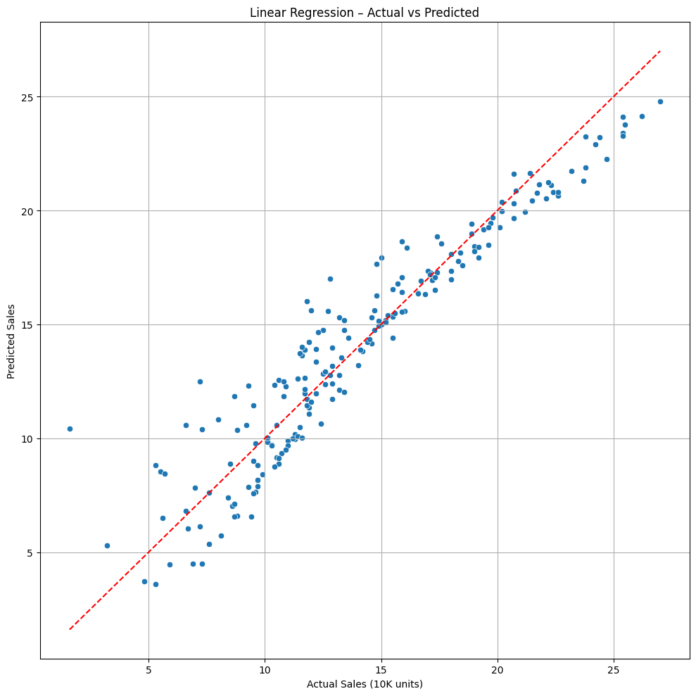

*The scatter plot shows excellent agreement between actual and predicted sales, with points closely following the ideal prediction line (red dashed).*

### Model Interpretation
- **TV advertising** has the strongest impact on sales
- **Radio advertising** shows synergistic effects with TV
- **Newspaper advertising** has minimal impact
- The model can reliably predict sales with ~1,670 units margin of error

### Key Insights
✅ **Excellent predictive power** - Linear regression captures the advertising-sales relationship very well  
✅ **No need for complex models** - Simple linear relationships are sufficient  
✅ **Actionable for business** - Clear ROI calculations possible for each channel

---

## 🍷 Wine Quality Dataset

### Dataset Overview
- **Source**: [UCI Wine Quality - Red](https://archive.ics.uci.edu/ml/machine-learning-databases/wine-quality/winequality-red.csv)
- **Features**: 11 physicochemical properties (acidity, sugar, pH, alcohol, etc.)
- **Target**: Quality score (3-8, treated as regression)
- **Samples**: 1,599 red wine samples
- **Challenge**: Subjective quality ratings, imbalanced distribution

### Part 1: Polynomial Regression Analysis

#### Experiment Setup
```python
from sklearn.preprocessing import PolynomialFeatures
from sklearn.pipeline import Pipeline

# Test different polynomial degrees
degrees = [1, 2, 3, 4]
for degree in degrees:
    poly = PolynomialFeatures(degree=degree)
    model = Pipeline([
        ('poly', poly),
        ('linear', LinearRegression())
    ])
```

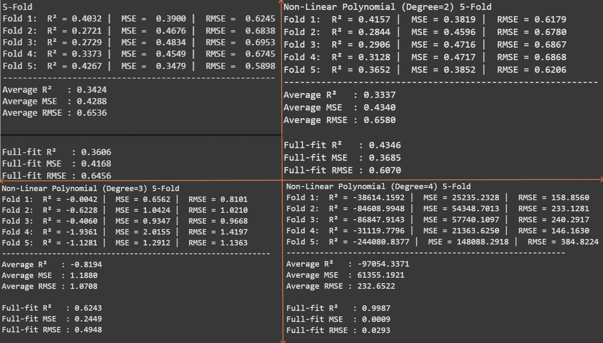

#### Performance by Polynomial Degree

| Degree | Avg R² (CV) | Avg MSE | Avg RMSE | Full-fit R² | Status |
|--------|-------------|---------|----------|-------------|---------|
| 1 (Linear) | 0.3424 | 0.4288 | 0.6536 | 0.3606 | ✅ Baseline |
| 2 | 0.3357 | 0.4340 | 0.6580 | 0.4346 | ✅ Stable |
| 3 | -0.8194 | 1.1880 | 1.0708 | 0.6243 | ❌ Overfitting |
| 4 | -97054.34 | 61355.19 | 232.65 | 0.9987 | ❌ Severe Overfitting |

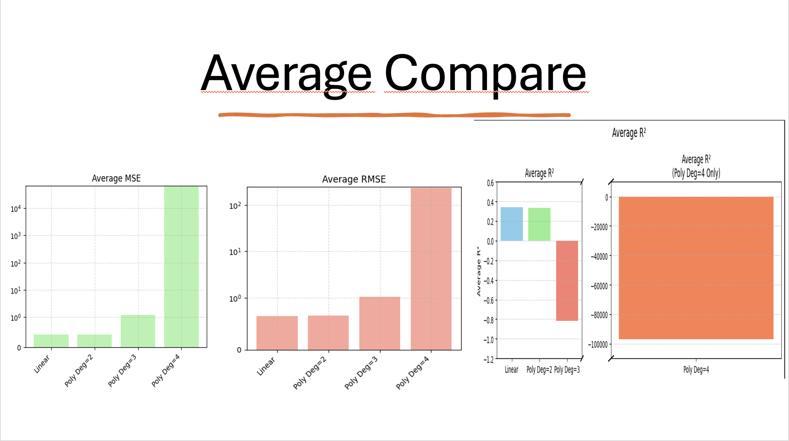
*Bar charts showing explosion in MSE and RMSE for higher degrees*

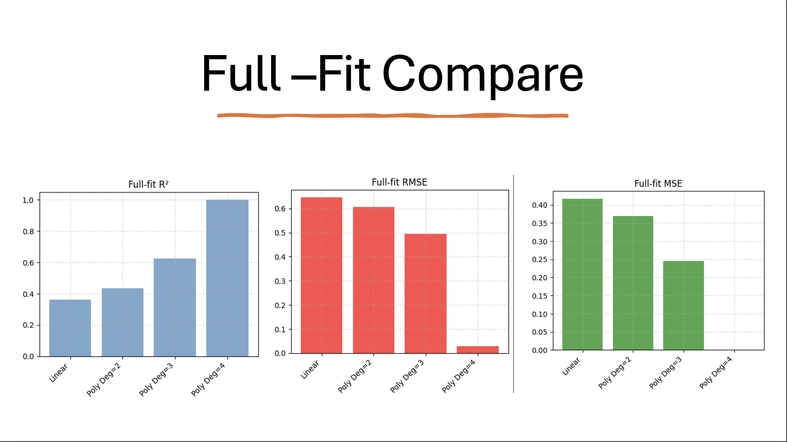
*Full-fit R² is misleading - shows near-perfect fit for degree 4 despite terrible generalization*

**Key Finding**: Polynomial features don't improve wine quality prediction and cause severe overfitting for degree > 2.

### Part 2: Feature Selection Analysis

#### Correlation Analysis
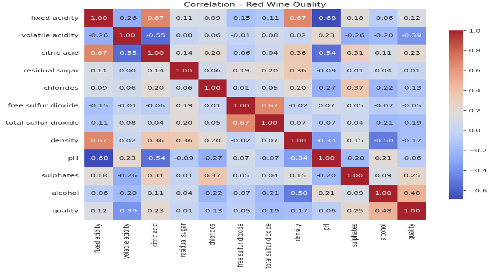

**Top 6 Features by Absolute Correlation with Quality**:
1. **alcohol**: 0.48 (strongest positive)
2. **volatile_acidity**: -0.39 (strongest negative)
3. **sulphates**: 0.25
4. **citric_acid**: 0.23
5. **density**: -0.17
6. **chlorides**: -0.13

#### Implementation
```python
# Select top 6 features
selected_features = ['alcohol', 'volatile_acidity', 'sulphates', 
                    'citric_acid', 'density', 'chlorides']
X_selected = df[selected_features].values

# Compare with all features
X_all = df.drop('quality', axis=1).values
```

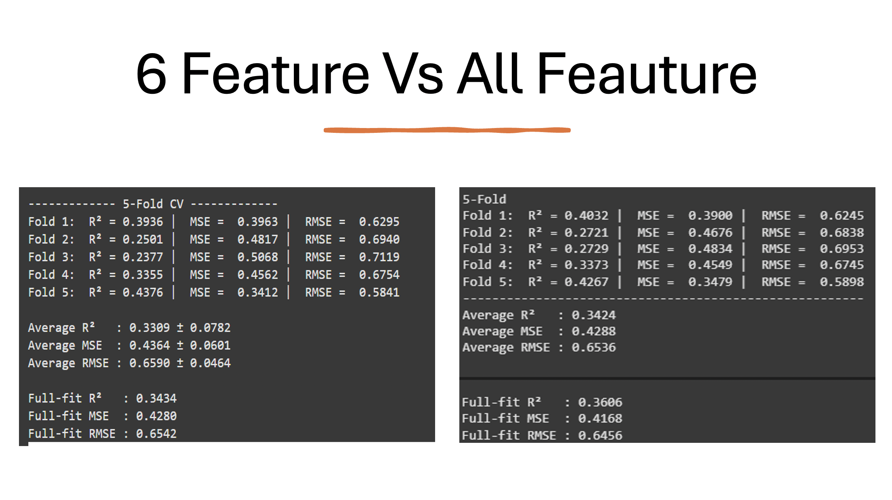

#### Performance Comparison

| Model | Features | Avg R² | Avg MSE | Avg RMSE | Difference |
|-------|----------|--------|---------|----------|------------|
| Selected | 6 | 0.3309 | 0.4364 | 0.6590 | -3.4% R² |
| All | 11 | 0.3424 | 0.4288 | 0.6536 | Baseline |

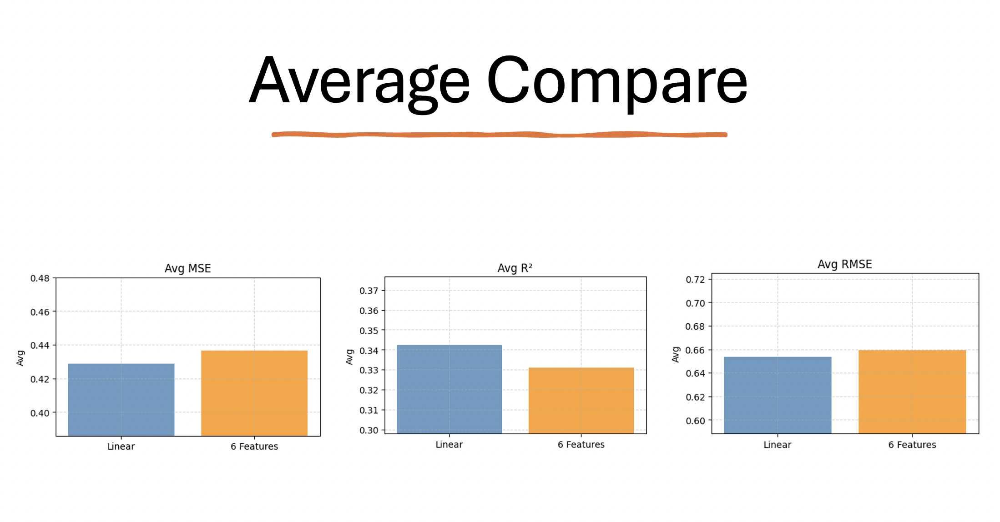
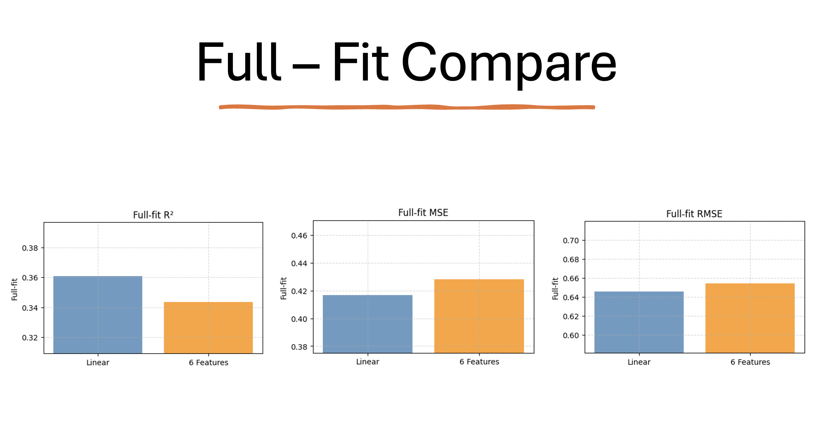

**Key Finding**: 45% feature reduction with only 3.4% performance loss - excellent trade-off for model simplicity!

### Part 3: Cross-Validation Methods Comparison

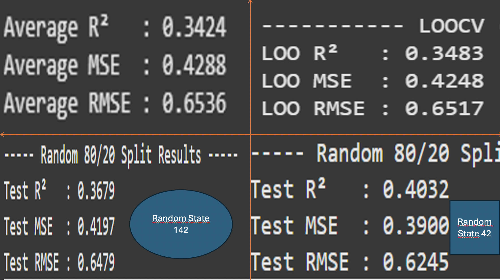

#### Different CV Strategies

| Method | R² | MSE | RMSE | Notes |
|--------|-----|-----|------|--------|
| 5-Fold CV | 0.3424 | 0.4288 | 0.6536 | Good balance |
| LOOCV | 0.3483 | 0.4248 | 0.6517 | Most stable, slow |
| Random (rs=142) | 0.3679 | 0.4197 | 0.6479 | Lucky split |
| Random (rs=42) | 0.4032 | 0.3900 | 0.6245 | Very lucky split |

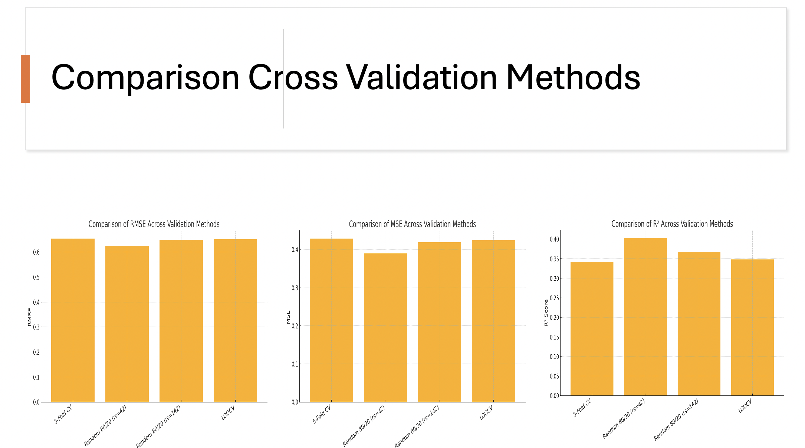

**Key Insights**:
- LOOCV provides most reliable estimate but is computationally expensive
- Random splits show high variance (R² ranges from 0.367 to 0.403)
- 5-Fold CV offers best practical balance
- Wine quality is inherently difficult to predict (R² ~0.34)

---

## 🏠 California Housing Dataset

### Dataset Overview
- **Source**: Scikit-learn built-in dataset (`fetch_california_housing`)
- **Features**: 8 housing characteristics (median income, house age, avg rooms, etc.)
- **Target**: Median house value (in $100,000s)
- **Samples**: 20,640 observations
- **Goal**: Predict house prices with regularized polynomial features

### Ridge Regression Implementation

```python
from sklearn.linear_model import Ridge
from sklearn.preprocessing import PolynomialFeatures
from sklearn.pipeline import Pipeline

# Test different alpha values
alphas = [0.1, 1000, 100000]
for alpha in alphas:
    model = Pipeline([
        ('poly', PolynomialFeatures(degree=2)),
        ('ridge', Ridge(alpha=alpha))
    ])
```

### Model Comparison Results

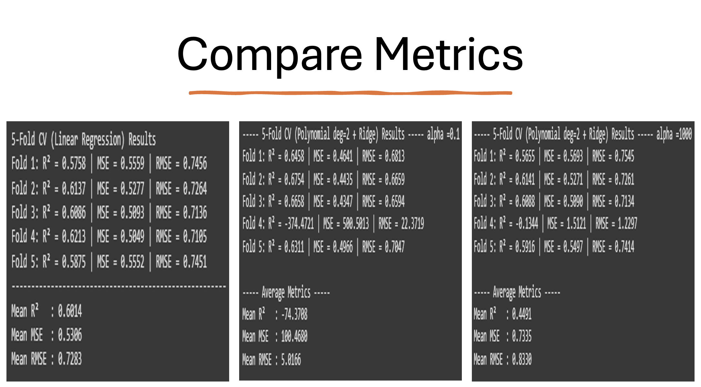

#### Performance Summary

| Model | Avg R² | Avg MSE | Avg RMSE | Analysis |
|-------|--------|---------|----------|-----------|
| **Linear Regression** | 0.6014 | 0.5306 | 0.7283 | ✅ Best overall |
| **Poly(2) + Ridge(α=0.1)** | -74.37 | 100.47 | 5.0166 | ❌ Severe overfitting |
| **Poly(2) + Ridge(α=1000)** | 0.4491 | 0.7335 | 0.8330 | ⚠️ Controlled but lower performance |

### Alpha Parameter Analysis

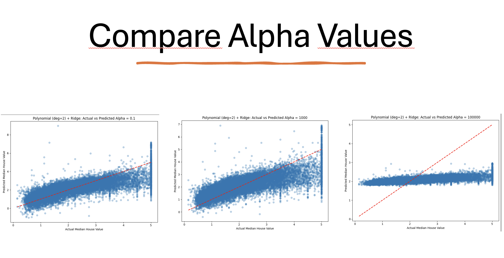

#### Visual Analysis of Different Alpha Values

| Alpha | Effect | Visual Pattern |
|-------|--------|----------------|
| **α = 0.1** | Minimal regularization | Wild predictions, high variance |
| **α = 1000** | Balanced regularization | Reasonable fit, controlled variance |
| **α = 100000** | Over-regularization | Predictions compressed to mean |

**Key Findings**:
1. Linear regression outperforms polynomial models for housing data
2. Polynomial features require careful regularization
3. California housing has more linear than polynomial relationships
4. Alpha tuning is critical - too low causes overfitting, too high causes underfitting

---

## 🔄 Cross-Validation Comparison

### Why Cross-Validation Matters

Cross-validation helps us:
- Avoid overfitting to specific train/test splits
- Get reliable performance estimates
- Choose between different model configurations

### Methods Compared

1. **K-Fold (K=5)**
   - Splits data into 5 equal parts
   - Each part used as test set once
   - Good balance of bias/variance

2. **Leave-One-Out (LOOCV)**
   - Each sample used as test set once
   - Most thorough but expensive
   - Best for small datasets

3. **Random Train/Test Split**
   - Simple 80/20 split
   - Results vary with random state
   - Quick but less reliable

### Recommendations by Dataset Size

| Dataset Size | Recommended Method | Reason |
|--------------|-------------------|---------|
| < 1,000 | LOOCV | Can afford computation |
| 1,000-10,000 | 5-Fold or 10-Fold | Good balance |
| > 10,000 | 3-Fold or Random | Computation time |

---

## 🎯 Key Takeaways

### Performance Summary by Dataset

| Dataset | Best Model | R² Score | Key Learning |
|---------|------------|----------|--------------|
| **Advertising** | Linear Regression | 0.8972 | Linear relationships dominate |
| **Wine Quality** | Linear + Feature Selection | 0.3424 | Subjective target, hard to predict |
| **California Housing** | Linear Regression | 0.6014 | Polynomial features cause overfitting |

### General Insights

1. **Start Simple**: Linear regression should be your baseline
2. **Polynomial Features**: High risk of overfitting, use with strong regularization
3. **Feature Selection**: Can maintain performance with fewer variables
4. **Cross-Validation**: Essential for reliable performance estimates
5. **Regularization**: Critical when model complexity increases

### Decision Framework

```
Start with Linear Regression
    ↓
Is R² satisfactory? → Yes → Use it!
    ↓ No
Try Feature Engineering/Selection
    ↓
Still need improvement? → Try Polynomial Features (degree ≤ 2) with Ridge
    ↓
Always validate with Cross-Validation
```

### Understanding Your Data First

Before choosing any model, understanding the nature of your problem is crucial:

1. **Linear Relationships**: If your data has linear patterns, linear regression will perform excellently (as seen in Advertising dataset with R² = 0.90)
2. **Non-linear Relationships**: If relationships are non-linear, linear regression will struggle - but be careful with polynomial features!

### The Overfitting Trap

A key indicator of overfitting:
- **High full-fit score + Low cross-validation score = Overfitting**
- Example from Wine Quality (Degree 4): Full-fit R² = 0.9987 but CV R² = -97054!

**"Good full-fit might reflect problem's nature"** - Be careful:
- If both full-fit AND cross-validation are good → Yes, correct model
- If only full-fit is good → Probably overfitting
- Example: Degree 3 with full-fit 0.62 but CV -0.82 → Definitely overfitting

### Polynomial Degree Selection

Finding the right polynomial degree is critical:
- **Too low**: No improvement over linear regression
- **Too high**: Severe overfitting
- **Sweet spot**: Usually degree 2, rarely need more than 3

**Degree selection guidelines:**
- **Degree 2**: Sufficient for most cases (quadratic patterns). Real-world data rarely requires polynomials beyond degree 2!
- **Degree 3+**: Very rare, requires strong regularization
- **Best practice**: Use validation curves to find optimal degree

**Solution**: Use Ridge regression to control complexity when using polynomial features.

### When to Use Each Technique

| Technique | Use When | Avoid When |
|-----------|----------|------------|
| **Linear Regression** | Clear linear relationships | Highly non-linear data |
| **Polynomial Features** | Known non-linear patterns | Small datasets |
| **Feature Selection** | Many features, interpretability needed | Already few features |
| **Ridge Regression** | Multicollinearity, many features | Need sparse models |

---

## 📊 Reproducibility

All experiments use:
- `random_state=42` for reproducibility
- Standardized preprocessing
- Consistent evaluation metrics

## 🤝 Contributing

Feel free to:
- Add new datasets
- Try different algorithms
- Improve visualizations
- Fix bugs

## 📄 License

This project is open source and available under the MIT License.

---

**Author**: naholav  
**Last Updated**: June 2025  
**Technologies**: Python, Scikit-learn, Pandas, NumPy, Matplotlib, Seaborn
